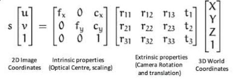
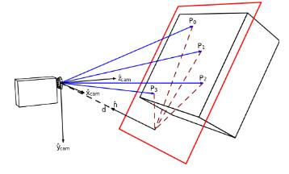
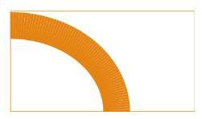

# Lab 4: Vision In Tesse
| Deliverable | Due Date              |
|---------------|----------------------------------------------------------------------------|
| Briefing (upload on github pages site)   | Wednesday, March 31st at 1:00PM EDT     |
| [Team Member Assessment](https://docs.google.com/forms/d/e/1FAIpQLSc--nSO-ml92FV00CBpUzuo6Nk8dNRFLSzMrIfgBwc9WyEgjQ/viewform?usp=sf_link)  | Friday, April 2nd at 11:59PM EDT |

## Introduction

Welcome to Lab 4, where you will learn about color segmentation, some feature detection algorithms, and how to use the semantic segmentation camera in tesse to allow the racecar to park using a colored cone and follow lines!

The semantic segmentation camera provides images that classify every object in the image by displaying them with a different color according to the object label. (You can see the camera images when you run `rqt_image_view` after your tesse-ros-bridge node and executable are up and running.)

The images from the semantic segmentation camera look something like this:

We provide you with a csv file that maps these semantic class labels to the rgba colors in the image, and you will do a combination of image processing and control to complete the tasks in this lab.

In this lab, your team will do the following:
* Experiment with object detection algorithms
* Learn how to transform a pixel from an image to a real world plane
* Develop a parking controller to park your robot in front of an orange cone
* Learn how to detect a road lane line in images
* Extend your parking controller into a line following controller

### Submission and Grading
Lab 4 will require a briefing, but no report. You will deliver an 8-minute briefing presentation (plus 3 minutes Q&A) together with your team, upload the briefing slides to your github pages website, and submit a [team member assessment form](https://docs.google.com/forms/d/e/1FAIpQLSc--nSO-ml92FV00CBpUzuo6Nk8dNRFLSzMrIfgBwc9WyEgjQ/viewform?usp=sf_link). See the deliverables chart at the top of this page for due dates and times.

You can view the rubric for the [briefing](https://docs.google.com/document/d/1NmqQP7n1omI9bIshF1Y-MP70gfDkgEeoMjpWv8hjfsY/edit) for more details on specific grading criteria. You will receive a grade out of 10 points. Your final lab grade will also be out of 10 points, based on the following weights:

| Deliverable Grade | Weighting              |
|---------------|----------------------------------------------------------------------------|
| briefing grade (out of 10)  | 80% |
| satisfactory completion of Module 1 | 5% |
| satisfactory completion of Module 2 | 5% |
| satisfactory completion of Module 3 | 5% |
| satisfactory completion of Module 4 | 5% |

The elements you should include in your Lab 4 presentation include:
- Explaining your IOU scores achieved to analyze the performance of color segmentation in module 1
- Explaining the homography transformation. How do we convert pixels to plane coordinates?
- Explaining vision algorithm used/implemented for cone detection, and demo a working parking controller.
- Explaining vision algorithm used/implemented for line detection, and demo a working line follower.
- Demonstrating and explaining the performance of your controllers. Make sure you mention your method for tuning the controller gains for both parking and line-following. Hint: include error plots from **rqt_plot**

### Lab Modules
This lab has a lot in it, so we are encouraging parallelization by breaking up the components of the lab into 4 distinct modules, which you will combine together. Each module tackles an interesting problem in computer vision/controls.  
- Module 1: Cone Detection via Color Segmentation
- Module 2: Homography Transformation of images to the world plane
- Module 3: Cone Detection and Parking In Tesse
- Module 4: Line Detection via Hough Transforms

Here's how they fit together:
In Module 1, you will learn a basic color segmentation algorithm to find objects in images and get familiar with some opencv funtions to identify a cone in images. 

In Module 2 you will learn how to transform a pixel coordinate to the frame of reference of the robot in the world! 

Now that you know how to find a cone in images and transform that coordinate to the real world, Module 3 involves developing a parking controller to navigate the tesse car to park in front of an orange cone in simulation. 

Finally, you're going to learn one additional feature detection algorithm in Module 4 for extracting lines from images and use your knowledge of homography and the same parking controller to follow a dashed lane line in simulation. You can see how each module builds on top of the previous one.  

### Computer Setup and Important Tesse Links
For this lab, you will need Opencv3. The virtual machines already have it, but it likely needs to be updated to 3.4 and are missing the opencv-contrib package (this is where some propietary algorithms were moved to in opencv3). If you are running linux natively, depending on what you've done before you may or may not have the correct setup. Try running these commands as well, and the correct packages will install as needed.

Steps:

`sudo apt-get install python-pip`

`pip install opencv-python==3.4.2.16`

`pip install opencv-contrib-python==3.4.2.16`

`pip install imutils`

You will also need tesse set up. Refer to instructions in [TESSE setup handout](https://github.com/mit-rss/tesse_install) if you need a reminder.

Make sure you checkout the `visual_servoing_tesse` branch of `tesse-ros-bridge` [here](https://github.mit.edu/rss/tesse-ros-bridge/tree/visual_servoing_tesse)! Spawn points will not work for this lab otherwise. 

Lastly, download the new most up to date executable for lab 4 [here](https://drive.google.com/drive/u/1/folders/18dQDeseaLYEjFnNGEQhOgWi1wMHtVmdu)
**remember to update your IP addresses after you pull tesse-ros-bridge**

Look at the tesse_install [handout](https://github.com/mit-rss/tesse_install) for a refresher on how to launch tesse if you need it. 99% of networking issues will be resolved if you follow the steps in the handout, so please refer to it :).

### Analysis:
We are also looking for a bit more in terms of experimental analysis in the lab than we have in the past. We are, in particular, looking for analysis of your vision algorithm and the controller.

Vision Analysis:
We wrote some code to test the Intersection over Union (IOU) scores of your vision algorithms on the datasets provided. IOU is a measure of how accurate bounding boxes are, and is a choice metric for analysis of object detection algorithms (including for neural networks!). Go into **computer_vision/**  and run:

`python cv_test.py cone`

To test your algorithm against the cone dataset. Results will be outputted to a .csv file in **scores/**. Some images will not yield good results. This is expected, and we would like to know why the algorithm works/doesn't work for certain images in your writeup.

Controller analysis:

When you write the parking controller in Module 3, you will be publishing error messages. Now it’s time to use **rqt_plot** to generate some plots. Try running the following experiments:
- Drive your car around in tesse (after launching the cone detector node) so the segmentation camera faces the cone from different locations and angles, then launch your parking controller. Your car should drive straight to the cone and stop in front of the cone. Show us plots of x-error and total-error over time, and be prepared to discuss.
- Compare plots at different speeds, and see how error signals change with speed.

Be able to explain why this controller works for line following as well, and demonstrate the working algorithm and what changes you had to make.

# Nodes and Topics

Line Finder Vision Node:
 - Subscribes: `/tesse/seg_cam/rgb/image_raw` [Image](https://docs.ros.org/en/melodic/api/sensor_msgs/html/msg/Image.html)
 - Publishes: `/lane_line` [LaneLine](https://github.com/mit-rss/visual_servoing_tesse/blob/main/msg/LaneLine.msg)

Cone Parking Vision Node:
 - Subscribes: `/tesse/seg_cam/rgb/image_raw` [Image](https://docs.ros.org/en/melodic/api/sensor_msgs/html/msg/Image.html)
 - Publishes: `/relative_cone_px` [PointStamped](http://docs.ros.org/en/kinetic/api/geometry_msgs/html/msg/PointStamped.html)

Homography Node:
 - Subscribes: `/relative_cone_px` [PointStamped](http://docs.ros.org/en/kinetic/api/geometry_msgs/html/msg/PointStamped.html)
 - Subscribes: `/lane_line` [LaneLine](https://github.com/mit-rss/visual_servoing_tesse/blob/main/msg/LaneLine.msg)
 - Publishes: `/relative_cone` [cone_location](https://github.com/mit-rss/visual_servoing_tesse/blob/main/msg/cone_location.msg)
 - Publishes: any rviz markers for the cone :)

Parking/Line Follower Controller Node:
- Subscribes: `/relative_cone` [cone_location](https://github.com/mit-rss/visual_servoing_tesse/blob/main/msg/cone_location.msg)
- Publishes: `/tesse/drive` [AckermannDriveStamped](http://docs.ros.org/en/melodic/api/ackermann_msgs/html/msg/AckermannDriveStamped.html)
- Publishes: `/parking_error` [parking_error](https://github.com/mit-rss/visual_servoing_tesse/blob/main/msg/parking_error.msg)

# Module 1: Cone Detection Via Color Segmentation
In lecture we learned lots of different ways to detect objects. Sometimes it pays to train a fancy neural net to do the job. Sometimes we are willing to wait and let SIFT find it. Template matching is cool too.

But sometimes simple algorithms are the correct choice, and for our purposes, identifying the cone by its distinctive color will prove most effective. Your job in this module will be identify cones (and other orange objects) and output bounding boxes containing them.

Take a peek at **cone_detection/color_segmentation.py**. Here you will find your starter code, though there is very little of it. There is a considerable degree of freedom in implementing your segmentation algorithm, and we will try to guide you at a high level. When it comes to opencv functions and examples, Googling will not disappoint. Keywords like “python” and “opencv3” will help you avoid c++ and older opencv versions of functions.

The cool thing about this module is that you can build up your algorithm incrementally. Display the original image. Modify, convert, filter, etc. and see what it looks like. Try a different opencv function. See what that does to the already changed image.

Here are some helpful hints:
- As we’ve seen in lecture, there are different color spaces. You are probably used to RGB/BGR, but you’ll find the HUE in HSV to vary less with lighting. Try cvtColor. Speaking of, the images here are BGR, not RBG.
- Use cv2.inRange to apply a mask over your image, keeping just what you want.
- Erosion and dilation are a great way to remove outliers and give your cone a bit more of a defined shape.
- OpenCV contour functions can prove very helpful. cv2.findContours + cv2.boundingRect are a powerful combination. Just saying.

Don’t forget conventions! Image indexing works like this (in this lab):

### Evaluation:
We are using the Intersection Over Union metric for evaluating bounding box success. Run **python cv_test.py cone color** to test your algorithm against our dataset. We print out the IOU values for you. We expect some sort of analysis involving this metric in your presentation.
By the way- you won’t get them all (probably). But 100% accuracy is not necessary for a great parking controller.

# Module 2: Homography Transformation

In this section you will use the camera to determine the position of objects in the world frame. To achieve this, you will need to understand and apply a relative transformation between coordinate frames.

### Converting pixel coordinates to x-y coordinates
If you recall from lecture, a camera is a sensor that converts 3D points (x,y,z) into 2D pixels (u,v). If we put on our linear algebra hats, we can take a peek at the projection of a 3D point to a 2D point:

In robotics, we are generally concerned with the inverse problem. Given a 2D (image) point, how can we extract a 3D (world) point?
We need some tools and tricks to make that sort of calculation, as we lost (depth) information projecting down to our 2D pixel. Stereo cameras, for example, coordinate points seen from two cameras to add information and retrieve the X-Y-Z coordinates.
In this lab, we will use another interesting fact about linear transformations to back out the X-Y positions of objects on the ground from the pixels they appear in. 

### Coordinate space conversion
The racecar can’t roll over or fly (no matter how cool it might look), so the ZED camera will always have a fixed placement with respect to the ground plane. By determining exactly what that placement is, we can compute a function that takes in image pixel coordinates (u, v) and returns the coordinates of the point on the floor (x, y, 0) relative to the car that projects onto said pixel.

This “function” is called a homography. Even though we can’t back out arbitrary 3D points from 2D pixels without lots of extra work, we can back out 2D world points if those points lie on a plane (and can therefore be thought of as 2D) that is fixed with respect to our camera.

Check out this illustration of a camera and world plane. There exists a linear transformation between the camera projection and the world plane, since the world plane has two dimensions like an image plane.

### The Homography Matrix
To find the homography matrix, we choose at least four points on the 2D ground plane, and find which pixels they occupy in the camera image. A pairing of real-world point and its camera pixel is known as a point correspondence. If you gather enough of these point correspondences (at least 4), you have enough information to compute a homography matrix. The homography matrix looks like this:

### Implementation

Many existing packages including [OpenCV](https://docs.opencv.org/2.4/modules/calib3d/doc/camera_calibration_and_3d_reconstruction.html#findhomography) can be used to compute homography matrices from point correspondences. 

We have provided you with an (almost-complete) `HomographyConverter` node! This node subscribes to the `/relative_cone_px` and `/lane_line` topics, which are defined in pixel (u, v) coordinates, and publishes a corresponding target point in relative ground-plane (x, y) coordinates to `/relative_cone`. 

The `HomographyConverter` starts by picking four arbitrary (x, y) points in the ground plane (z=0). It projects these points into the camera frame, using the known intrinsic and extrinsic properties of the camera: 

Then it calls to an OpenCV function to compute the homography matrix, which enables the reverse projection from pixel coordinates (u, v) back into ground plane points (x, y):

Your task is to help the the `HomographyConverter` project some points from the ground plane into the camera frame, and then use those points to compute the homography matrix (which performs the reverse projection). You will need to fill in the `seg_cam_info_callback` function. The intrinsic camera matrix is read for you from the appropriate ROS message. You will need to define the extrinsic camera matrix manually, then apply the appropriate mathematical operations on PTS_GROUND_PLANE, and finally compute the homography matrix with an appropriate call to `cv2.findHomography`.

Here is some information that will be useful in constructing the extrinsic camera matrix:
- In the robot frame, the z-axis points up, the x-axis points forward, and the y-axis points to the left.
- The orientation of the xy- image plane is illustrated in the Module 1 section. We consider the z-axis of the image coordinate frame to point forward from the robot.
- The segmentation camera in tesse is mounted 0.05m to the left and 1.50m to the front of the robot body center. It is elevated 1.03 meters above the ground. (You can find these parameters yourself for all TESSE cameras in `tesse-ros-bridge/ROS/params/camera_params.yaml`.)

# Module 3: Cone Detection and Parking In Tesse
Actual Cone (in green box)|  Segmentation      | Cone in mask 
--------------------|--------------------|---------------------------
 | | 

In this section, you will detect a cone using the segmentation camera of the tesse simulator. You will then drive your car(tesse car) towards the cone, and finally park the car in front of the cone.

**step 1**: Using the algorithms you have practiced in the Module 1 of this lab and the segmentation camera of the tesse car, you need to find the location of the cone in the view of the camera. 

We provided a skeleton code that subscribes to the proper messages for you, `src/cone_detector.py`. Your task is to find the center of the cone in image coordinates and publish that to the topic `/relative_cone_px` using the geometry message [PointStamped](http://docs.ros.org/en/kinetic/api/geometry_msgs/html/msg/PointStamped.html). The PointStamped message has three coordinates (XYZ), use X and Y to store the center of the cone. Make sure the frame ID of your point is the same as the segmentation image. You should the publish this point via the topic `/relative_cone_px`, and your homography node should transform your point to the topic `/relative_cone`.

Look at the skeleton launch file `launch/cone_detector.launch` to see how to make the car spawn and launch your cone detector node. Use the argument `big_cone_parking` for `/track` to spawn at a reasonable distance and angle away from the cone. We also provided the segmentation label and RGB color of the cone which is defined at the top of `src/cone_detector.py`.

**Step 2**: 
Implement a controller that drives the tesse car towards the cone until you're desired distance away and at a desired angle. 
The robot will start with the cone in the field of view of the camera and should drive directly to the cone and park in front of it (1.5 - 2 feet from the front). Parking means facing the cone at the correct distance, not just stopping at the correct distance. See an example video of what we mean on the physical cars [here](https://gfycat.com/obesevioleticelandicsheepdog).

The distance and angle don’t act independently so consider carefully how you should make them work together.

Your parking controller should subscribe from `/relative_cone` to get the coordinates of the cone with respect to the base_link_gt (car) frame. You can `rostopic echo /relative_cone` to verify these coordinates make sense from the homography node.

We aren’t aiming to give you a specific algorithm to run your controller, and we encourage you to play around. Try answering these questions:
- What should the robot do if the cone is far in front?
- What should the robot do if it is too close?
- What if the robot isn’t too close or far, but the cone isn’t directly in front of the robot?
- How can we keep the cone in frame when we are using our real camera?

**Step 3**:
The last thing for you to do is publish the x_error, y_error, and distance (sqrt(x**2 + y**2)) error. Fire up a terminal and type in: rqt_plot. A gui should emerge, which gives you the ability to view a live plot of (numerical) ros messages.

These plots are super useful in controller tuning/debugging (and any other time you need to plot some quantity over time). Tips:

- Type in the topic you want to graph in the top left of the gui.
- Adjust the axes with the icon that looks like a green checkmark (top left menu bar).

You will be using these plots to demonstrate controller performance for your presentation.

# Module 4: Line Follower
We're going to be implementing a realistic line following controller and deploying it on the road! Specifically, your task is to follow the center line of the road as closely as possible.

Here is the view from the semantic segmentationcamera; as you can see, the lane markers are rendered in dark blue:

  Original      | Segmentation Camera
--------------------|---------------------------
 | 

Sometimes the lanes are double lines and sometimes they are dashed, so first we're going to write a node that extracts a single approximated line from our images in slope-intercept form (y = mx + b).

The first step is to extract the semantic label and color that identify the lane marker. The semantic label associated with our lane marker is in `params_tesse.yaml`. You can then extract the rgba value associated with that semantic label from `tesse_windridge_city_scene_segmentation_mapping.csv`. You can see in the skeleton `src/line_finder.py` a helper function for how we extract the color of the lane marker from the parameters and csv.

Then you'll want to apply a mask over your image just like in cone detection to keep just the lane markers. What else can you mask out? (hint: There probably won't be any lanes in the sky.) Dilation is a good way to exagerate the road lines (relevant for the dashed ones) so they don't dissapear in the next line finding step!

The meat and potatoes of this module is the [Hough Line Transform](https://opencv-python-tutroals.readthedocs.io/en/latest/py_tutorials/py_imgproc/py_houghlines/py_houghlines.html). This will allow you to detect broken and imperfect lines in the image. In practice you will end up with many hough lines like the left image below, so you will need to average them to be one single line.
The averaged line should be like the red line below.

  Many Hough LInes      | Averaged Line
--------------------|---------------------------
 | 

Once you have the m and b of this averaged line, publish your line message to the `lane_line_topic` specified in `params_tesse.yaml` using the provided `LaneLine.msg` type. Again, you can see all the correct topics in the skeleton file `src/line_finder.py`.

The homography node will subscribe from this `lane_line_topic` and transform a point on your line in from the image plane to the ground with respect to your robot! Now, you're ready to follow a line through a small modification to your working parking controller.

To follow a line, your code can publish a spoofed "cone" target at a fixed lookahead distance (greater than the desired parking distance). This target point should always lie on the lane you're trying to follow. Like a donkey chasing a carrot, if you restrict the view of your robot to a line segment some fixed distance ahead, you will continouously follow this line.

See an example of following a line by chasing a lookahead point [here](https://gfycat.com/SeveralQueasyAmberpenshell).

  Original      | Cropped
--------------------|---------------------------
 | 

## Bringing it together:
Suggested steps:

1. Write a ros node using Module 2 that publishes the relative location of a cone in view of the segmentation camera. Make sure you can see the cone in rviz before trying to do control. You should now be able to teleop your car around and accurately determine its position relative to the car using just the camera. Make sure to publish a Marker to RVIZ representing the cone. The rviz cone should appear where the real cone does.
2. Implement a parking controller to navigate to and stop in front of the cone, listen to the relative cone position, and publish drive commands. Congratulations are in order when you can park successfully.
3. In Module 4, detect the dashed lane line by first using hough transforms to extract the lines from the image and then averaging into a main lane line you wish to follow. It's helpful to visualize the masked images generated by opencv to debug. Once you have this line, publish to a lane line message so your homography node can subscribe to it and publish the relative location on the line a certain lookahead distance away from the car.
4. Modify your parking controller to listen to your new "relative cone" and follow the line.

### General Tips/FAQ:

Segmentation Camera:
We provide you with a ground truth semantic segmentation image from simulation to complete your tasks in tesse. In the real world, you don't have these ground truth semantic labels and semantic segmentations, and you'll have to use more complex feature extraction methods. However, a lot of the techniques we learned in this lab are incorporated in algorithms for real life autonomous driving. Modifications to your line detection algortihm can detect lanes in real rgb images. See an example here: https://www.youtube.com/watch?v=lWhunNd0q3Q&ab_channel=GalenBallew.
