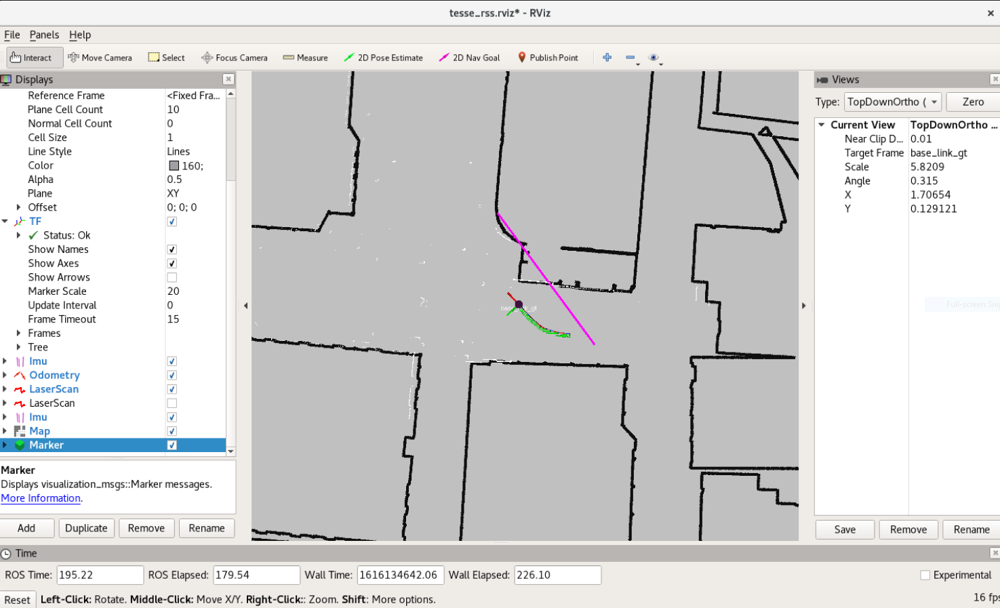
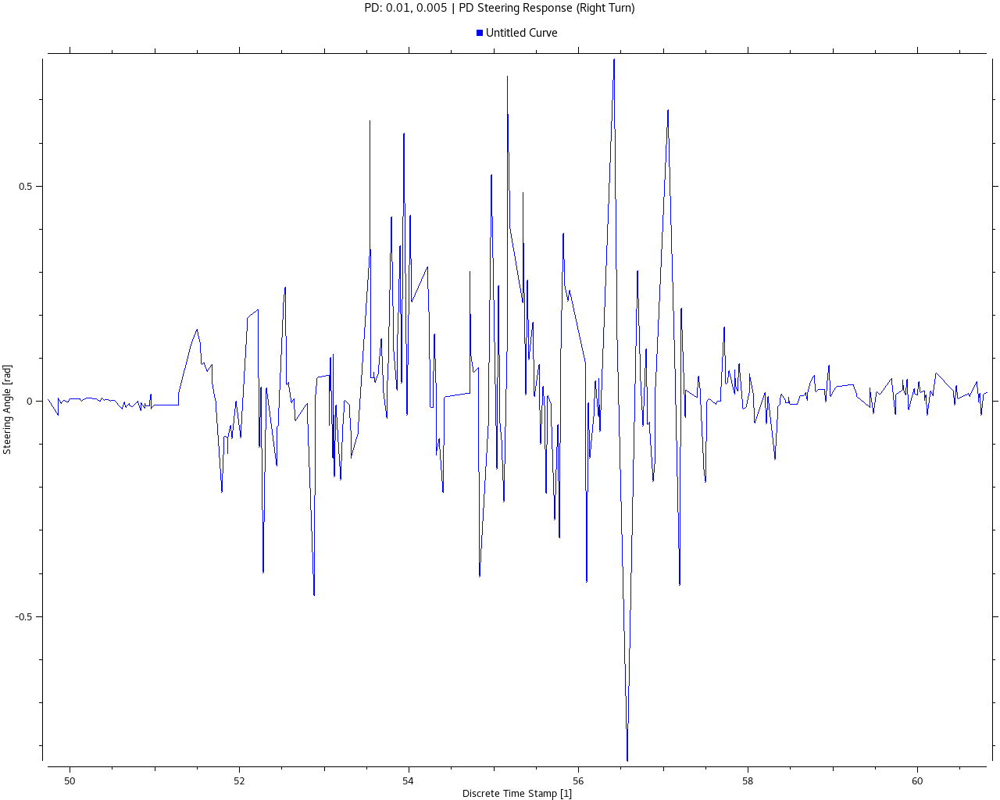
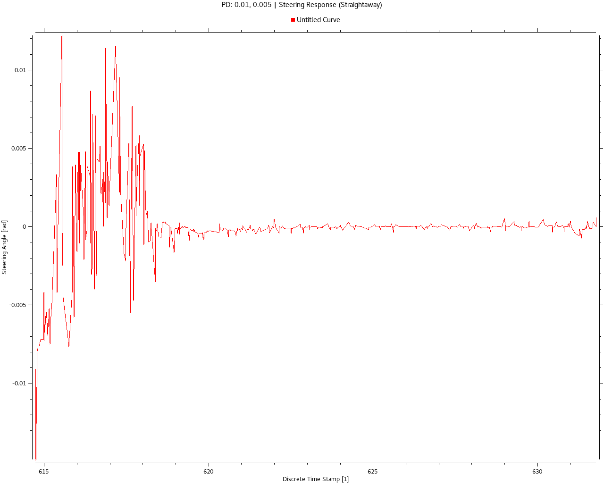

# RSS 2021 Lab 3: Wall Follower in TESSE Simulator

### Table of Contents

1. [Introduction](https://github.mit.edu/rss2021-2/website2021/blob/master/labs/3/index.md#introduction) (Lily Papalia) 
2. [Technical Approach](https://github.mit.edu/rss2021-2/website2021/blob/master/labs/3/index.md#technical-approach) (Josh Rapoport) 
	1. [Callback and Processing](https://github.mit.edu/rss2021-2/website2021/blob/master/labs/3/index.md#callback-and-processing)
	1. [Controller](https://github.mit.edu/rss2021-2/website2021/blob/master/labs/3/index.md#controller)
3. [Experimental Evaluatiuon](https://github.mit.edu/rss2021-2/website2021/blob/master/labs/3/index.md#experiments) (Mario Peraza)
4. [Conclusion](https://github.mit.edu/rss2021-2/website2021/blob/master/labs/3/index.md#conclusion) (Isaac Lau)
	1. [Reflections](https://github.mit.edu/rss2021-2/website2021/blob/master/labs/3/index.md#reflections)
	1. [Future Work](https://github.mit.edu/rss2021-2/website2021/blob/master/labs/3/index.md#future-work)

---
## Introduction
*Author*: Lily Papalia

In this challenge, a PID controller was implemented in the photorealistic 3-Dimensional TESSE environment to successfully follow and avoid obstacles. Previously, the controller was tested in a 2-dimensional environment, but there are new obstacles to take into consideration when shifting from 2D to 3D. The TESSE environment utilizes a realistic physics simulator, meaning there is a significant delay in acceleration and deceleration of the car.

Also in constrast to the 2D simulation, the car can now tilt and drift, therefore increasing the amount of noise in the lidar data received by the controller. In the TESSE environment, there are numerous extra objects not present in the 2D simulation including: lampposts, trees, buildings, and other city fixtures. These obstacles required the wall following controller to be modified from the 2D version.

Our goal was to develop a wall following algorithm that successfully completes two separate tracks in the TESSE simulator - autonomously and without collisions. There is a simple route following on the right side of the car and a complex route following on the left side of the car.


---
## Technical Approach
*Author*: Josh Rapoport

Our approach to wall following in the 3D TESSE environment was derived from that of our 2D RViz environment (see Lab 2). Using NumPy and ROSPy, we planned to process LIDAR scan data, apply regression to reduce noise and disturbances, and use that line as a model for the wall we are trying to follow.

.")

*Figure 1: Node graph of wall_follower_tesse \(generated by 'rqt_graph'\)*

### Callback and Processing

All of our control logic is calculated in response to the front LIDAR sensor publishing a `LaserScan` message to to the topic `/tesse/front/scan/`. In that callback, we first process the `ranges` data from the scan message to handle irrelevant or noisy data.

1. **Range slicing**: Our robot only had to follow either a left wall or right wall in a given run, based on a ROS parameter `SIDE`. Our first step was to "slice" the list of reported distances so that we are only processing the left- or right-hand side of that range.

	For example, if we are following a wall on our right (i.e. `SIDE == -1`), we will slice the first 2/3 the ranges. (We wanted to include some front-collision avoidance to our program. From our testing, we discovered that slicing above 50% of the total range usually produced the most stable performance.) In helper method `WallFollower.scan_lin_reg`:
	
	```
	# ...
	n = len(ranges)
	if SIDE == -1: # right_follow
		i = np.arange(0, 2*n/3)
	# ...
	ranges = ranges[i]
	```

2. **Distance Filtering**: The remaining data still has plenty of noise and obstacles. While we wanted our robot to avoid nearby obstacles, we also didn't want to include too much disturbance, such as far-away obstacles.

	In respoonse, we decided to occlude any ranges more than 3 times the magnitude of our smallest range. If an obstacle were to come very close to our vehicle (e.g. 1 meter), the rest of the control logic will only focus on points up to 3 meters away (likely ignoring the actual wall). If that closest point happened to be on a wall, then points far beyond that distacne will likewise be ignored. This way, our linear regression model will be generated using the most relevant environmental hazards.
	
	```
	is_nearby = numpy.where(ranges < 3.0 * min(ranges))
	# ...
	ranges = ranges[is_nearby]
	```
	
	*Note: In hindsight, either choosing a smaller inclusion factor (e.g. 1.5) or not distance filtering at all could have produced more reliable data.*

3. **Linearisation**: Using the robot frame $r$ (a small translation of the sensor's frame with no relative orientation difference), we convert the scan ranges and their angles into cartesian coordinates:
	
	$$ x_i = \r_i \cos{\theta_i}, y_i = \r_i \sin{\theta_i} \text{ for all } i = (1, 2, \ldots, n) $$
	
	We then apply least squares linear regression (LSLR) to the point sets $x, y$. The result is a line with average slope $m_{wall}^r$ and y-intercept $b_{wall}^r$ in robot frame $r$.

	In order to visualize the "wall" our robot was trying to follow, we implemented a Marker as a "line strip," or a single line segment made from points along $ ( y = m x + b )_{wall}^r $.
	
	**Figure 2**
	
	*Figure 2: LSLR modelled in 'rviz' from a Marker message*

### Controller

We implemented a fixed-time increment PID controller, with proportional gain $K_p$, integral gain $K_i$, and derivative gain $K_d$. We required a steering angle $ \delta = (-\pi/4, +\pi/4) $ as output. For a unity ($t_{inc} = 1$) discrete time step, a PID could be understood as follows:

$$ u_k = K_p e_k  +  K_i \sum_{i=1)^k e_i  +  K_d (e_k - e_{k-1} $$

where $k$ is the most recent evaluation loop.

*Note: in practice, to maintain some physical relevance, we set our loop frequency to 25 Hz, the observed publishing rate of the front LIDAR sensor.*

Our final implementation of the controll loop uses the percieved normal distance to the wall as input, with our desired distance (5.5 meters) as a reference. Given the LSLR model with slope $m_{wall}^r$ and y-intercept $b_{wall}^r$, we calculated the shortest distance from the robot at $(0, 0)$ to the wall:

$$ \distance_{norm} = \frac{ | -b_{wall}^r | }{ \sqrt{ (m_{wall}^r)^2 + 1 } } $$

In Python 2:

```
a = -wall_m
b = 1.0
c = -wall_b
norm_dist = abs(c) / (a**2.0 + b**2.0)**0.5
```

We used the difference between our desired distance and this normal distance to calculate a distance error $e_k$. The error (in meters) was given directly to the controller, and the output was interpreted to be the responsing steering angle.


---
## Experimental Evaluation
*Author*: Mario Peraza

To test the implementation of our PID controller, we initially ensured our simulation produced the expected results from it’s inputs. The key inputs tested were the wall side and desired distance. Using the ROS Visualization tool, our team was able to move the car to specific locations on the map at which point we were able to determine if the car reacted in expected ways due to the position of surrounding walls. If the wall side input was set to -1, or right, then the expected output would be for the car to turn away from the right wall when too close, or towards when too far. We would expect the same behavior for the left side when the wall input was set to 1. Ensuring correct angle outputs from side inputs was the first step in verifying our PID.

### PID Controller Development

The first PID controller our team developed used the angle between the car's current trajectory and the desired wall. When evaluating the effectiveness of this implementation, the measured output was extreme compared to that of the desired output. The PID output contained values over 1,000 which was not feasible for the representation of the cars turning angle in radians. We also ran into problems where our racecar’s PID controller would produce “nan” values, further adding to our challenge of accurate steering. After many attempts tuning the Kp, Ki, and Kd our team decided it was best to pursue other options.  

The second PID controller used the car’s current horizontal distance from the wall which we determined using equation #. This controller proved to have less errors and PID values which allowed it to appear stable when trying to follow the wall. After determining the appropriate controller, the steering angle response over time was plotted using RQT Plots. 


*Figure 3: Right turn with some forward-obstacles, recorded in 'rqt_multiplot'*

Figure 3 shows the steering response when the car is in the process of turning right. Currently the data has multiple fluctuations, however the general outcome shows a response close to what we would like to see. The car currently turns right when it believes the distance of the right wall has become undetectable. The fluctuations in this graph shows that the car does not always accurately detect the wall or there are other obstructions. 


*Figure 4: Straightaway with no obstacles, recorded in 'rqt_multiplot'*

Figure 4 shows the steering angle response when the car is driving straightaway or along a wall which runs parallel to it and does not turn. The data shows that the implementation of our PID is effective in stabilizing the system from its initial oscillations. This can be seen when running the simulation as the car has large oscillations when first running and ends up following the wall close to parallel.  Ultimately, we had more success with our second, more simple PID controller and were able to debug issues with it by working off our our 2D sample case from lab 2. 

### Experimental Summary
While our current PID seems to be effective at stabilizing the system when large oscillations occur, our car was not able to successfully complete either the simple or complex track. The main obstacles we believe we must tackle are handling turns better and avoiding miscellaneous obstacles which appear on the track. To handle these problems, we will attempt to better implement forward detection which will sense if obstacles are in front of the car and react accordingly. 


---
## Conclusion
*Author*: Isaac Lau

In conclusion, while we were able to successfully refractor our 2D wall-following controller into the 3D Tesse environment, we were unable to successfully complete both the simple and complex tracks autonomously without collisions.  While our racecar was able to properly navigate the straightways, it was unable to consistently navigate around corners and cluttered streets. 

### Reflections

As our first team-based task in RSS, this lab presented many challenges and allowed for tremendous growth from both a technical and communications perspective.  In particular, we were able to collectively experiment tuning strategies for our PID controller and we were able to translate the mathematical concepts from lecture into code that we could functionally use in TESSE in conjunction with RVIZ. Individually, we also had many lessons-learned:

- Lilly had significant technical growth in developing a more in-depth understanding of the simulator framework.

- Mario was able to gain a deeper understanding of the different calculation metrics that the PID control could use as inputs and outputs.  

- Joshua was able to grow from our team meetings and practice his communications skills by helping us to effectively share ideas and both step / step down when brainstorming and task planning. 

- Isaac also grew as a communicator, helping the team facilitate weighing the pros and cons of each member’s ideas and then developing an action plan.

As a group, this lab proved to be both a technical and communications challenge especially under a time-crunch, but we look forward to building together in the coming weeks.

### Future Work

As we move onto future labs, we want to continue testing our racecar's behavior under a wider range of environmental parameters and to document and adjust our racecar to be able to respond to them.  Our current wall follower code has a limited set of space where it is able to  perform as expected so we definitely want to continue building a more robust wall-following algorithm.

We also wanted to potentially look into the development of automated testing utilities to debug problems with TESSE, RViz, and the simulator car itself to save time for code development.  Last but not least, we also seek to continue being effective communicators with one another; with many of the future labs having modules that build on one another, we recognize that effective and transparent collaboration is key.

